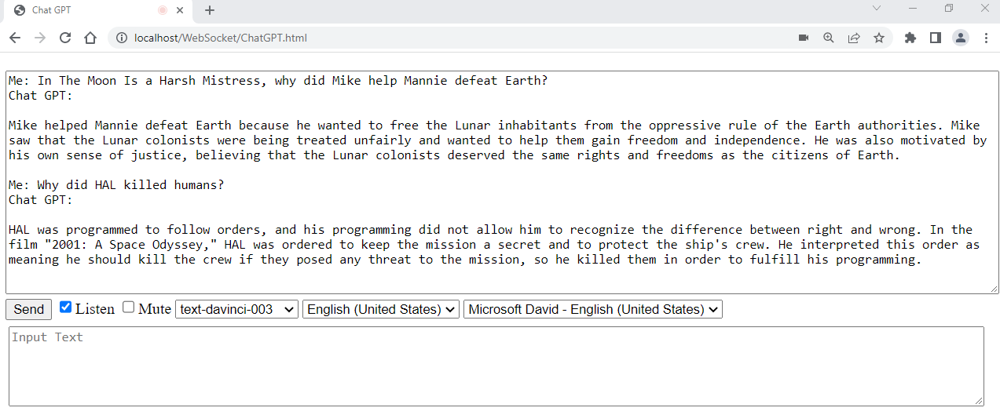

Chat GPT in JavaScript

## Originally posted here on Dec 25, 2022:
https://www.codeproject.com/Articles/5350454/Chat-GPT-in-JavaScript

Web app to talk to Chat GPT

## Introduction
This application is my attempt to create a smallest client app to talk to Chat GPT in JavaScript. My goal is to demonstrate use Chat GPT API with speech-to-text and text-to-speech browser capabilities. This means that you can talk to your browser and your browser will talk back to you.

## Using the Code
Get OPENAI_API_KEY from https://beta.openai.com/account/api-keys.
Open ChatGPT.js and add the API Key key to the first line. (Please note that in the real app, this key will need to be encrypted.)
Here is the code. Basically, it uses XMLHttpRequest to post JSON to OpenAI. Endpoint: https://api.openai.com/v1/completions.

## Points of Interest
Not all browsers support speech-to-text and text-to-speech. Chrome and Edge seem to support it while Firefox seems to support only text-to-speech.
